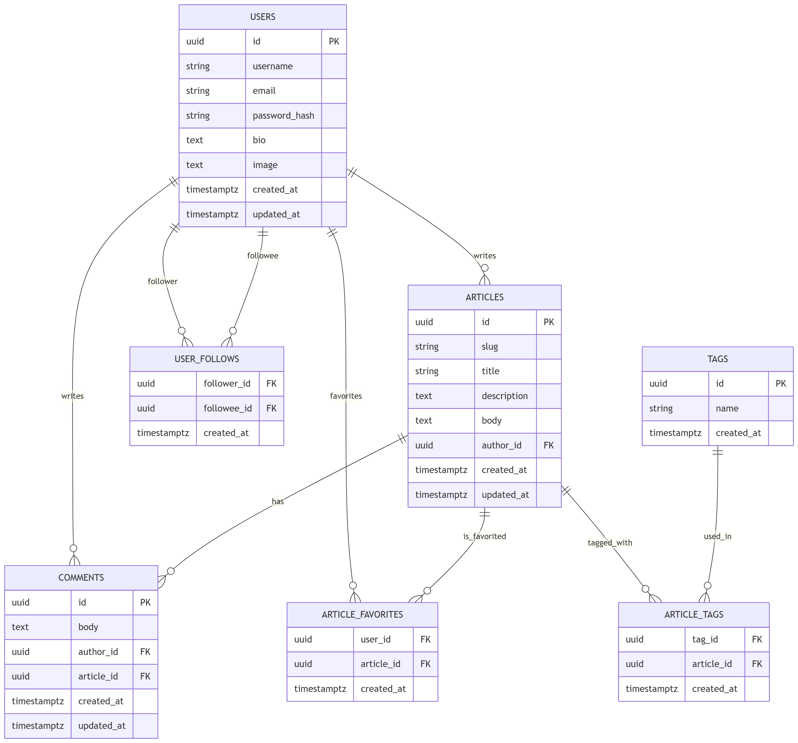

# Conclusions

Building this RealWorld demo was a lot of fun. I learned a great deal and discovered many things I did not expect beforehand.

# Why Rust matters

This section reflects my personal view on Rust and why it may be a strong alternative to languages such as Java, Python, or TypeScript.

For many years, similar applications were built using a traditional stack with a strict separation between client and server:

Server-side:

* Java (Spring)
* Node.js
* Python (Django)

Frontend:

* Browser-based applications using React, Angular, HTML, and JavaScript

Rust provides an opportunity to significantly improve performance while reducing memory and CPU usage on both the client and server side.

It also enables code sharing between client and server, which reduces duplication and improves consistency.
With Rust’s strict type system and compiler guarantees, many issues can be detected at compile time, enabling deeper correctness checks earlier in the development process.
Code generation can also be integrated safely into this model.

I am increasingly convinced that HTML and the browser are not ideal foundations for enterprise user interfaces. A quick look at browser memory consumption suggests that this model is inherently heavy.
In contrast, egui, both as a desktop UI and as a WebAssembly target in the browser, is significantly more lightweight and performant.

WebAssembly itself may become a key technology for secure and efficient sandboxed execution environments for both client and server-side use cases.

For most enterprise applications, development cost has traditionally been the dominant part of total cost of ownership. However, with the increasing use of AI, development is becoming cheaper. As a result, runtime cost will become more important.

It is difficult to ignore that Rust applications can be 10–100× smaller and significantly more resource-efficient.
In the long term, Rust development may also become cheaper as the ecosystem matures, more experienced developers become available, and best practices stabilize.

Traditional architectures often introduce overhead due to strict separation between client and server development. A single-language approach can eliminate much of this duplication and complexity.

Languages like Python or TypeScript are attractive in terms of productivity, but they cannot match the performance of compiled languages. Rust’s ability to compile to multiple targets makes it just as portable as VM-based languages.

Older ecosystems such as Smalltalk, Delphi, and Visual Basic were highly productive because they allowed developers to build entire systems in a single language and environment. 
In some sense, Rust brings back that idea in a modern form.

There is also great value in fast, reliable software with no memory leaks. In many cases, this is more important than fancy UI effects or animations.

# Cost of complexity

Multiple programming languages and complex devops, architectures makes the project big even at start.
Many project members that need even more member to coordinate.
Big project often mean more money but if result matters you should consider to reduce the complexity at start.

# It is really small

Here the binary sizes and used memory.
It is really more than 10x smaller.
It means it starts immediately.
The whole server fits into CPU memory cache.
It can run on small cheap devices or low level cloud services. 

You do not need any fancy architectures if the application is just fast and you safe a lot of money on server costs.

|| application || binary size || runtime size ||
| fat-client | 11MB | |
| quic-client | 10MB | |
| web-client | 6MB | |
| quic-server | 9MB | 9MB |
| web-server | 6MB | |

Even wasm web-client loads and starts immediately. It is some MB big but it is loaded
at once. Wasm compilation is even faster then load time. No JS overhead.

Because Rust do not waste memory on garbage collector the memory usage is small and depends only on throughput.
So you do not need to reserve 20 GB for it.

I have not tested the of the quic-server. It will be quite interesting to compare how quic protocol perform in comparison to https.
Currently web-server starts http. Quic protocol is already secured.

Quic-Server and Quic-client could be good alternatives to common native mobile apps.
The small memory print is on mobile apps even more important.

I suppose that many embedded devices could use the same techniques.

# With the little help of AI

I enjoy writing code myself, but I also use AI extensively as a documentation tool and knowledge assistant.

In this project, I aim to understand every line of code. At the same time, I believe that with better AI-assisted documentation, this project could evolve into a template for agent-based software development.

It would be interesting to see whether AI systems can reproduce or extend such architectures.

Adding new features or modifying the UI should be relatively straightforward for AI systems, especially when patterns are consistent.

AI is currently good at generating code based on existing patterns, but less reliable when it comes to designing entirely new architectures or paradigms—especially in unfamiliar languages. Because of this, AI may become more of a “reader and extender” of such systems rather than a primary architect

# My Conclusions About Rust as a Programming Language

Rust is a powerful systems programming language that can also be used effectively for application development.

Building typical enterprise applications using libraries such as SeaORM, Serde, Axum, and Egui is nearly as convenient as using Java or Python, while offering significantly better performance characteristics.

Rust’s abstractions are strong enough to support “business application” development with efficiency comparable to Java, C#, TypeScript, or Python.

Enums and pattern matching are particularly powerful and contribute to highly readable code.

The Rust compiler becomes a strong partner in development, helping enforce type safety and correctness at compile time.

# Egui - UI Library (intermediate model)

Egui was originally developed in the gaming domain as a Rust reimplementation of immediate-mode GUI concepts similar to ImGui.

It does not provide built-in support for complex enterprise features such as advanced data grids or rich layout systems.
However, it is very responsive and pleasant to use because of its immediate-mode design.
Egui is not intended to replicate HTML/CSS-based UI systems or corporate design frameworks. Instead, it favors simplicity and performance.

Creating custom UI components in Egui is relatively easy due to its immediate-mode architecture.

Recently, many new UI frameworks have been emerging in Rust. Several of them are strong candidates for building cross-platform business applications.

The architecture presented in this project is intentionally designed to be flexible, so that egui can be replaced with another UI framework if needed.
This makes it easier to compare different UI approaches while keeping the rest of the system unchanged.

# Outlook

There is still significant work required to make this demo suitable for production use.

I have observed that much of the code could be generated. However, I do not believe that Rust macros are the right solution for complex systems of this type, as they are difficult to adapt once generated.

I am generally interested in frameworks for rapid application development, such as:
* ruby on rails
* python django
* [python odoo](https://www.odoo.com/)
* java spring boot
* java hipster
* delphi or [lazarus](https://www.lazarus-ide.org/) (old but indeed really good and productive)

Many low-code platforms allow applications to be built by modeling UI and storing application state in a metadata database. In such systems, the application is essentially defined by database state.

However, this approach has limitations. Modern AI systems work better with text-based representations, and text integrates more naturally with version control systems such as Git.

For this reason, I believe that text-based model-driven architectures (MDA), combined with good language server support, may be a promising direction. I have experimented with tools such as TextX
, and found them quite effective.

If you have ideas or would like to collaborate, feel free to contact me at: mail@xdobry.de
