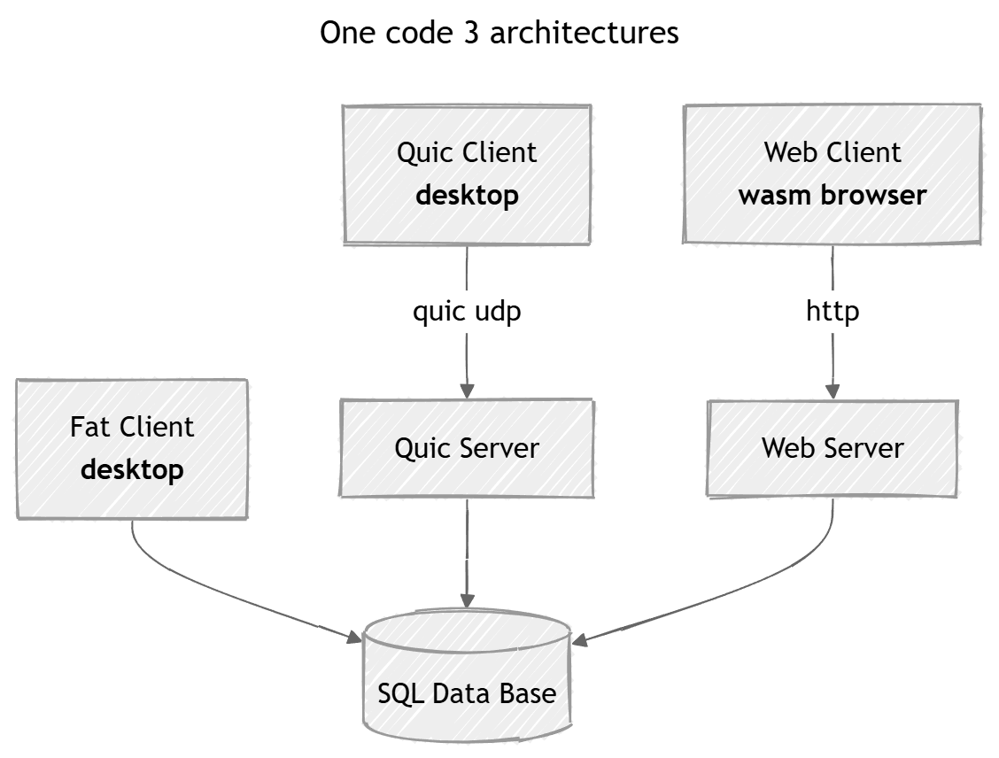
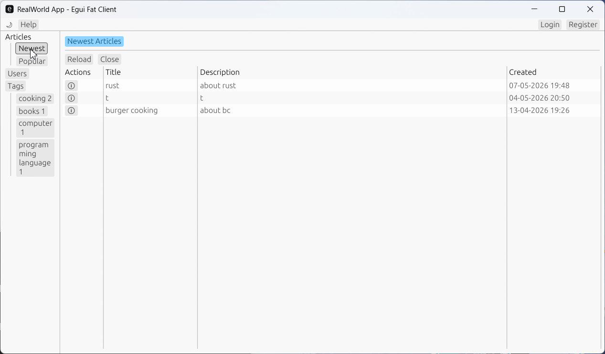

# RealWorld App – Rust + egui Multi-Architecture Demo

This project is a prototype implementation of the [realworl app](https://github.com/realworld-apps/realworld) using a `full-stack Rust` approach.
It is learning and programming fun project.
The prototype concerns only parts of needed functionality and lacks some features needed for production.

The project demonstrates multiple architectural variants:

* **Fat client:** native (desktop) client connects directly to the SQL database
* **Client–server:** native (desktop) client communicates with a server via `QUIC`
* **Web (WASM SPA):** egui-based WebAssembly client communicates with an `HTTP server` built with Axum.

The **UI** and **server core** are implemented only once and reused across all variants.
Only a few lines of code differ between the architectures.

It uses following rust libraries:
* [egui](https://github.com/emilk/egui) (ui interface)
* [sea orm](https://www.sea-ql.org/SeaORM/) persistence to sql server
* [quinn](https://github.com/quinn-rs/quinn) `quic` protocol for desktop client server. Secure ssl based protocol using udp.
* [axum](https://github.com/tokio-rs/axum) web server
* [postcard](https://github.com/jamesmunns/postcard) message serialization

# Goals of prototype

* Learn Rust and its ecosystem using a realistic “RealWorld” application
* Explore patterns for multi-target Rust architectures
* Share code between client and server
* Build a full-stack system using a single programming language
* Evaluate Rust in typical enterprise scenarios (e.g., database applications)
* Experiment with multi-crate project structures and code reuse
* Explore alternatives to dynamic binding and reflection in Rust
* Investigate alternatives to HTML, JavaScript, JSON, and HTTP for enterprise applications
* Explore how to write database-independent code using `SeaORM`

# Non considered parts

This prototype does not focus on:

* Performance benchmarking
* Polished UI
* User experience

It is not intended to serve as a production template or framework.

# Documentation

* [Installation Manual](Installation.md)
* [Architecture Description](Architecture.md)
* [Final Report and Outlook](Final_Report.md)

# Feedback and Contributing

Contributions are welcome. If you find a bug or notice anything unusual, please open an issue—small observations are valuable.

I am also interested in improving the use case, adding features, or exploring additional architectures (e.g., with Leptos, Yew, or Dioxus).

Feel free to open a GitHub issue or contact me at: mail@xdobry.de
